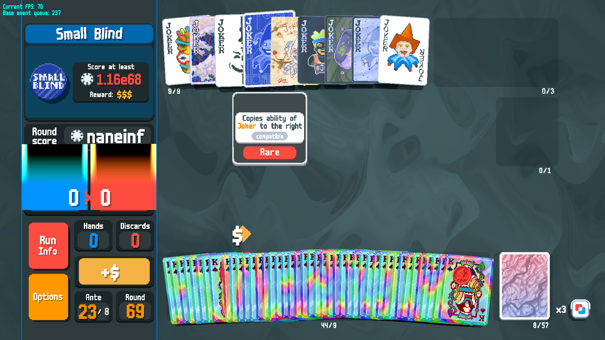

---

A Balatro mod focused on creativity and balance.

## About
This mod is intended to preserve the base game's balance while adding new gameplay. For the full experience, play without using `Unlock All`. For more information, see the [wiki](https://balatromods.miraheze.org/wiki/Manifold).

## Installing
### Method 1: Manual Install
1. Install [Steamodded](https://docs.smods.dev/Installation/).
2. Download the [latest release](https://github.com/ouiiskey/Manifold/releases/latest/download/Manifold.zip).
3. Place `Manifold.zip` in your `Mods` folder.

#### Updating
1. Delete the old version from your `Mods` folder.
2. Download the [latest release](https://github.com/ouiiskey/Manifold/releases/latest/download/Manifold.zip).
3. Place `Manifold.zip` in your `Mods` folder.

### Method 2: [JokerDeck](https://github.com/Ch3rryC0d3r/JokerDeck)
Note: Windows only.

### Method 3: [balatro-imm](https://github.com/frostice482/balatro-imm)

## Compatibility
Because this mod contains bespoke code, you may encounter compatibility issues with other mods.
#### Known compatible mods:
* [Amulet](https://github.com/frostice482/amulet)
* [Banner](https://github.com/SylviBlossom/Banner)
* [BetterTags](https://github.com/WaffleDevs/BetterTags)
* [Handy](https://github.com/SleepyG11/HandyBalatro)
* [JokerDisplay](https://github.com/nh6574/JokerDisplay)
* [Too Many Jokers](https://github.com/cg-223/toomanyjokers)
#### Known incompatible mods:
* [DebugPlus](https://github.com/WilsontheWolf/DebugPlus)
  * Copied planets emplace in the consumable slots, spawn the planets instead.
  * Spawning planets requires empty consumable slots.
* [DebugPlusPlus](https://github.com/jogla-the-wizard/DebugPlusPlus)
  * Using "Win blind" crashes the game unless you have DebugPlus installed.
* [Multiplayer](https://github.com/Balatro-Multiplayer/BalatroMultiplayer)
  * Activating Mana Gem can cause the lobby to hang.

## Issues
If you wish to report bugs or make suggestions, visit the [issue tracker](https://github.com/ouiiskey/Manifold/issues).

## Screenshots

  
Click to view

  
A naneinf build featuring the Zombie + Tsunami combo.

  
  
credit: HEAVENBRAND (2026/9/2)

